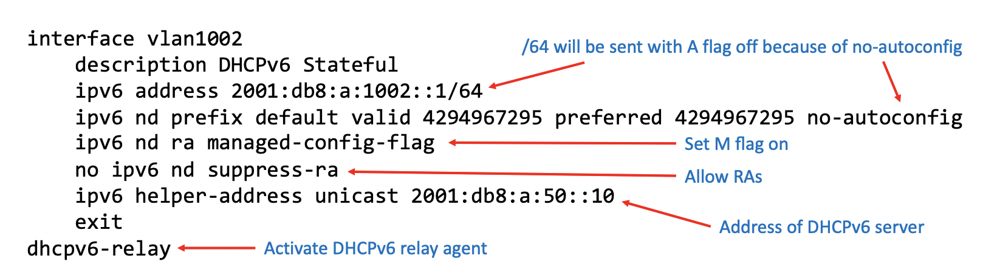

# Aruba AOS-CX IPv6 Address Allocation

## Abstract
This document explains the numerous methods of IPv6 address allocation available on the Aruba AOS-CX Network Operating System and details how to configure these different methods.

## IPv6 Address Allocation Overview

IPv6 addresses can be allocated to clients by a variety of methods:

1. Stateless Address Autoconfiguration - the client generates its own globally routable address using the /64 prefix advertised by the local gateway in a Router Advertisement (RA).

2. DHCPv6 Stateful - Through the exchange of DHCPv6 messages between client and DHCPv6 server, a /128 address is assigned to the client by the server. As part of this process, the DHCPv6 server can also assign additional options such as DNS server and DNS Search-List.

3. DHCPv6 Stateless - A combination of SLAAC and DHCPv6, the client generates its address via the prefix in the local gateway's RA, but also queries the DHCPv6 server for other information such as DNS server and search-list.

## Network Design

### Design Overview

* The main device under test is an Aruba AOS-CX 8320. This is the Layer 3 gateway, and the source of IPv6 Router Advertisements.
* The 8320 has connectivity to a Server LAN, upon which resides a Windows Server 2019 configured for DHCPv6.
* The 8320 is positioned as a core or aggregration layer switch. It is connected to an Aruba 3810M switch, which provides the access layer function and Power-Over-Ethernet. The 3810M is a Layer 3 switch but in this network it merely provides Layer 2 connectivity and PoE. It does not participate in the IPv6 network as a L3 node.
* Wireless connectivity is provided by an Aruba UAP303-HR Access Point.
* The 8320 is configured with four client subnets & VLANs which connect through the 3810M to the UAP's Uplink Port via an 802.1Q trunk.
* Each client subnet on the 8320 is configured with the necessary features to enable a connected client to obtain its IPv6 address by one of the various allocation methods, see the table below:

| VLAN | Prefix  |  Method | SSID  |
|------|---------|---------|-------|
| 1001 | `2001:db8:a:1001::/64` | SLAAC | v6net-SLAAC |
| 1002 | `2001:db8:a:1002::/64` | DHCPv6 Stateful | v6net-DHCPv6-Stateful |
| 1003 | `2001:db8:a:1003::/64` | DHCPv6 Stateless | v6net-DHCPv6-Stateless |
| 1004 | `2001:db8:a:1004::/64` | SLAAC & DHCPv6 | v6net-All-On |


### Network Kit List

* 1 x Windows Server 2019 - acting as DHCPv6 and DNS server.
* 1 x Aruba 8320 Switch running CX version 10.03.50 - this is the Layer 3 IPv6 gateway.
* 1 x Aruba 3810M Switch - acting as an access layer switch, providing PoE.
* 1 x Aruba UAP303HR Access Point - to enable wireless connectivity.


##### Network diagram


### AOS-CX IPv6 Address Allocation Methods

#### Baseline AOS-CX Configuration

The following 8320 configuration is required to enable basic connectivity in the test network:

```
vlan 1,5,1001-1004
interface 1/1/5
    no shutdown
    description LAN-trunk-port
    no routing
    vlan trunk native 1
    vlan trunk allowed 5,1001-1004
```

#### 1. SLAAC

* SLAAC requires that the gateway is configured with a /64 prefix on the Layer 3 interface.
* The AOS-CX device is configured to allow RAs (defaut is to suppress).
* Using this method the client will generate its own addresses from the received RA using any /64 prefix with the Autonomous (A) flag set to on, this is the default for AOS-CX.
* The number of addresses generated by the client, and the type of address, is client OS specific and configurable. Windows 10, macOS and Ubuntu Linux clients all generate two addresses, one is an RFC 7217 'stable-privacy' address and the other is a temporary address. The former has a longer lifetime and is the address registered with DNS if joining a Windows Active Directory Domain. The latter, the temporary address, is used as the source address for traffic originating from the client. This address usually expires after 24 hours, to reduce the possibility of client tracking by rogue agents.  
* SLAAC was extended with RFC8106 to allow the gateway to transmit information regarding the Recursive DNS Server (RDNSS) and DNS Search List (DNSSL). AOS-CX supports the configuration of RFC8106 options.


##### Configuration Example

###### Config Capture


###### Native CLI
```
interface vlan1001
    description SLAAC
    ipv6 address 2001:db8:a:1001::1/64
    no ipv6 nd suppress-ra dnssl
    no ipv6 nd suppress-ra rdnss
    ipv6 nd ra dns search-list actium.home
    ipv6 nd ra dns server 2001:db8:a:50::10
```

##### Notes

1. AOS-CX suppresses RA on layer 3 interfaces by default. RAs are allowed using the interface subcommand `no ipv6 nd suppress-ra`.
2. However, in this case the default RA behaviour is negated by allowing the RFC8106 options with `no ipv6 nd suppress-ra dnssl rdnss`. This command can be entered separate commands or as a single entry with both dnssl and rdnss keywords. It will appear in the running-configuration as separate commands.
3. If the AOS-CX device's Layer 3 interface is configured to transmit RAs, simply configuring an IPv6 address with a /64 mask is sufficient to enable the gateway to commence sending RAs onto the local segment with the prefix in question and the A flag set to on.
4. The RFC8106 RDNSS and DNSSL options are configured on the Layer 3 interface with `ipv6 nd ra dns server` and `ipv6 nd ra dns search-list`

#####  Router Advertisement Packet Capture


##### AOS-CX CLI Show Command Example

```
8320-1# show ipv6 nd interface vlan1001
Interface vlan1001 is up
  Admin state is up
  IPv6 address:
    2001:db8:a:1001::1/64 [VALID]
  IPv6 link-local address: fe80::d067:2683:e9e2:2778/64 [VALID]
  ICMPv6 active timers:
      Last Router-Advertisement sent: 230 Secs
      Next Router-Advertisement sent in: 50 Secs
  Router-Advertisement parameters:
      Periodic interval: 10 to 30 secs
      Router Preference: medium
      Send "Managed Address Configuration" flag: false
      Send "Other Stateful Configuration" flag: false
      Send "Current Hop Limit" field: 64
      Send "MTU" option value: 1500
      Send "Router Lifetime" field: 1800
      Send "Reachable Time" field: 0
      Send "Retrans Timer" field: 0
      Suppress RA: false
      Suppress MTU in RA: true
  ICMPv6 error message parameters:
      Send redirects: false
  ICMPv6 DAD parameters:
      Current DAD attempt: 1
```

##### macOS CLI captures

```
➜  ~ ifconfig en0
en0: flags=8863<UP,BROADCAST,SMART,RUNNING,SIMPLEX,MULTICAST> mtu 1500
	options=400<CHANNEL_IO>
	ether 8c:85:90:85:d9:cf
	inet6 fe80::1479:4dcb:db4d:cca0%en0 prefixlen 64 secured scopeid 0x5
	inet6 2001:db8:a:1001:aa:ecc2:e0cf:1700 prefixlen 64 autoconf secured
	inet6 2001:db8:a:1001:c5bf:8d02:d3ba:5d02 prefixlen 64 autoconf temporary
	nd6 options=201<PERFORMNUD,DAD>
	media: autoselect
	status: active
➜  ~
➜  ~ scutil --dns
DNS configuration

resolver #1
  search domain[0] : actium.home
  nameserver[0] : 2001:db8:a:50::10
  if_index : 5 (en0)
  flags    : Request AAAA records
  reach    : 0x00000002 (Reachable)
```

#### 2. DHCPv6 Stateful

* The gateway indicates to the connected client to obtain its IPv6 address by sending an RA with the Managed (M) flag set to 'on'.
* However, it is also valid for the client to transmit a DHCPv6 SOLICIT message prior to receiving an RA, thus defaulting to DHCPv6 Stateful regardless of gateway RA configuration.
* If the DHCPv6 server resides on a remote subnet, the AOS-CX gateway can be configured to forward DHCPv6 messages from the client using the `ipv6 helper-address` command.
* As part of the test environment the Windows 2019 DHCPv6 server will return a client address, DNS server and DNS search-list.
* DHCPv6 and SLAAC are not mutually exclusive, if a client OS receives an RA with a /64 prefix and the A flag 'on', it will generate its own addresses and also attempt to receive an address via DHCPv6. This can cause needless address profileration on a network, placing strain on the gateway's hardware resources. To avoid such a scenario, configure the gateway to set the M flag 'on' but the prefix A flag 'off'.

##### Configuration Example

###### Config Capture



###### Native CLI

```
interface vlan1002
    description DHCPv6 Stateful
    ipv6 address 2001:db8:a:1002::1/64
    ipv6 nd prefix default valid 4294967295 preferred 4294967295 no-autoconfig
    ipv6 nd ra managed-config-flag
    no ipv6 nd suppress-ra
    ipv6 helper-address unicast 2001:db8:a:50::10
    exit
dhcpv6-relay
```

#####  Router Advertisement Packet Capture


##### AOS-CX CLI Show Command Examples

```
8320-1# show ipv6 nd interface vlan1002
Interface vlan1002 is up
  Admin state is up
  IPv6 address:
    2001:db8:a:1002::1/64 [VALID]
  IPv6 link-local address: fe80::d067:2683:eae2:2778/64 [VALID]
  ICMPv6 active timers:
      Last Router-Advertisement sent: 299 Secs
      Next Router-Advertisement sent in: 17 Secs
  Router-Advertisement parameters:
      Periodic interval: 10 to 30 secs
      Router Preference: medium
      Send "Managed Address Configuration" flag: true
      Send "Other Stateful Configuration" flag: false
      Send "Current Hop Limit" field: 64
      Send "MTU" option value: 1500
      Send "Router Lifetime" field: 1800
      Send "Reachable Time" field: 0
      Send "Retrans Timer" field: 0
      Suppress RA: false
      Suppress MTU in RA: true
  ICMPv6 error message parameters:
      Send redirects: false
  ICMPv6 DAD parameters:
      Current DAD attempt: 1
```

##### macOS CLI captures
```
➜  ~ ifconfig en0
en0: flags=8963<UP,BROADCAST,SMART,RUNNING,PROMISC,SIMPLEX,MULTICAST> mtu 1500
	options=400<CHANNEL_IO>
	ether 8c:85:90:85:d9:cf
	inet6 fe80::1479:4dcb:db4d:cca0%en0 prefixlen 64 secured scopeid 0x5
	inet6 2001:db8:a:1002:8df4:2659:859c:cc5a prefixlen 64 dynamic
	nd6 options=201<PERFORMNUD,DAD>
	media: autoselect
	status: active

➜  ~ scutil --dns
DNS configuration

resolver #1
  search domain[0] : actium.home
  nameserver[0] : 2001:db8:a:50::10
  if_index : 5 (en0)
  flags    : Request AAAA records
  reach    : 0x00000002 (Reachable)
  ```

#### 3. DHCP Stateless

* The gateway indicates to connected clients to use DHCPv6 Stateless by setting the Other (O) flag to 'on' and including a /64 prefix for address creation.
* If the client OS transmits a DHCPv6 SOLICIT messsage by default, this will alter to a DHCPv6 INFORMATION-REQUEST messsage once the client receives an RA with the O flag 'on'.
* The DHCPv6 server is configured to return the DNS server and DNS search-list only.
* The client will use the /64 in the RA to generate its own addresses.

##### Configuration Example

###### Config Capture


###### Native CLI

```
interface vlan1003
    description DHCPv6 Stateless
    ipv6 address 2001:db8:a:1003::1/64
    ipv6 nd ra other-config-flag
    no ipv6 nd suppress-ra
    ipv6 helper-address unicast 2001:db8:a:50::10
    exit
dhcpv6-relay
```

#####  Router Advertisement Packet Capture


##### AOS-CX CLI Show Command Examples

```
8320-1# show ipv6 nd interface vlan1003
Interface vlan1003 is up
  Admin state is up
  IPv6 address:
    2001:db8:a:1003::1/64 [VALID]
  IPv6 link-local address: fe80::d067:2683:ebe2:2778/64 [VALID]
  ICMPv6 active timers:
      Last Router-Advertisement sent: 61 Secs
      Next Router-Advertisement sent in: 512 Secs
  Router-Advertisement parameters:
      Periodic interval: 10 to 30 secs
      Router Preference: medium
      Send "Managed Address Configuration" flag: false
      Send "Other Stateful Configuration" flag: true
      Send "Current Hop Limit" field: 64
      Send "MTU" option value: 1500
      Send "Router Lifetime" field: 1800
      Send "Reachable Time" field: 0
      Send "Retrans Timer" field: 0
      Suppress RA: false
      Suppress MTU in RA: true
  ICMPv6 error message parameters:
      Send redirects: false
  ICMPv6 DAD parameters:
      Current DAD attempt: 1
```

##### macOS CLI captures
```
➜  ~ ifconfig en0
en0: flags=8963<UP,BROADCAST,SMART,RUNNING,PROMISC,SIMPLEX,MULTICAST> mtu 1500
	options=400<CHANNEL_IO>
	ether 8c:85:90:85:d9:cf
	inet6 fe80::1479:4dcb:db4d:cca0%en0 prefixlen 64 secured scopeid 0x5
	inet6 2001:db8:a:1003:c79:6433:67f:6c3b prefixlen 64 autoconf secured
	inet6 2001:db8:a:1003:4960:dd43:d4bc:c500 prefixlen 64 autoconf temporary
	nd6 options=201<PERFORMNUD,DAD>
	media: autoselect
	status: active

➜  ~ scutil --dns
DNS configuration

resolver #1
  search domain[0] : actium.home
  nameserver[0] : 2001:db8:a:50::10
  if_index : 5 (en0)
  flags    : Request AAAA records
  reach    : 0x00000002 (Reachable)
```
#### 4. SLAAC and DHCPv6

* A common misconfiguration when enabling DHCPv6 is to leave the gateway configured with its default RA settings, for AOS-CX this means a /64 prefix is included in the RA with the A flag set to 'on'.
* Clients will generate addresses via SLAAC and still solicit DHCPv6 servers for address assignment.
* This undesirable but still workable scenario is included to detail the configuration that will create this setup.

##### Configuration Example

###### Config Capture


###### Native CLI

```
interface vlan1004
    description IPv6 All On
    ipv6 address 2001:db8:a:1004::1/64
    ipv6 nd ra managed-config-flag
    no ipv6 nd suppress-ra
    ipv6 helper-address unicast 2001:db8:a:50::10
    exit 
dhcpv6-relay
```

#####  Router Advertisement Packet Capture


##### AOS-CX CLI Show Command Examples

```
8320-1# show ipv6 nd interface vlan1004
Interface vlan1004 is up
  Admin state is up
  IPv6 address:
    2001:db8:a:1004::1/64 [VALID]
  IPv6 link-local address: fe80::d067:2683:ece2:2778/64 [VALID]
  ICMPv6 active timers:
      Last Router-Advertisement sent: 40 Secs
      Next Router-Advertisement sent in: 201 Secs
  Router-Advertisement parameters:
      Periodic interval: 200 to 600 secs
      Router Preference: medium
      Send "Managed Address Configuration" flag: true
      Send "Other Stateful Configuration" flag: false
      Send "Current Hop Limit" field: 64
      Send "MTU" option value: 1500
      Send "Router Lifetime" field: 1800
      Send "Reachable Time" field: 0
      Send "Retrans Timer" field: 0
      Suppress RA: false
      Suppress MTU in RA: true
  ICMPv6 error message parameters:
      Send redirects: false
  ICMPv6 DAD parameters:
      Current DAD attempt: 1
```
##### macOS CLI captures

```
➜  ~ ifconfig en0
en0: flags=8963<UP,BROADCAST,SMART,RUNNING,PROMISC,SIMPLEX,MULTICAST> mtu 1500
	options=400<CHANNEL_IO>
	ether 8c:85:90:85:d9:cf
	inet6 fe80::1479:4dcb:db4d:cca0%en0 prefixlen 64 secured scopeid 0x5
	inet6 2001:db8:a:1004:14de:72f5:f8d2:2a3c prefixlen 64 autoconf secured
	inet6 2001:db8:a:1004:b894:4f6c:49be:92c9 prefixlen 64 autoconf temporary
	inet6 2001:db8:a:1004:be8e:a86:94c4:4687 prefixlen 64 dynamic
	nd6 options=201<PERFORMNUD,DAD>
	media: autoselect
	status: active

➜  ~ scutil --dns
DNS configuration

resolver #1
  search domain[0] : actium.home
  nameserver[0] : 2001:db8:a:50::10
  if_index : 5 (en0)
  flags    : Request AAAA records
  reach    : 0x00000002 (Reachable)
```


